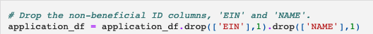
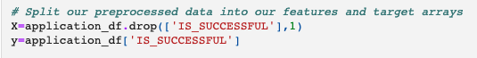

# Neural_Network_Charity_Analysis

## Overview
Alphabet Soup has raised and donated over 10 billion dollars in the past 20 years. This money has been used to invest in lifesaving technologies and organize reforestation groups around the world. This project is to analyze the impact of each donation and vet potential recipients. This helps ensure that the foundation's money is being used effectively. We are going to predict which orgaizations are worth donating to and which are too high risk. Since this problem is too complex for the statistical and machine learning models. We will design and train a deep learning neural network. This model will evaluate all types of input data and produce a clear decision making result. 

From Alphabet Soup’s business team, we received a CSV containing more than 34,000 organizations that have received funding from Alphabet Soup over the years. Within this dataset are a number of columns that capture metadata about each organization, such as the following:

- EIN and NAME — Identification columns

- APPLICATION_TYPE — Alphabet Soup application type

- AFFILIATION — Affiliated sector of industry

- CLASSIFICATION — Government organization classification

- USE_CASE — Use case for funding

- ORGANIZATION — Organization type

- STATUS — Active status

- INCOME_AMT — Income classification

- SPECIAL_CONSIDERATIONS — Special consideration for application

- ASK_AMT — Funding amount requested

- IS_SUCCESSFUL — Was the money used effectively

## Results
### Data Preprocessing

- Target

    'IS_SUCCESSFUL' -  Was the money used effectively, is considered the target for the model

- Features

    APPLICATION_TYPE : Alphabet Soup application type

    AFFILIATION : Affiliated sector of industry

    CLASSIFICATION : Government organization classification

    USE_CASE : Use case for funding

    ORGANIZATION : Organization type

    STATUS : Active status

    INCOME_AMT : Income classification

    SPECIAL_CONSIDERATIONS : Special consideration for application

    ASK_AMT : Funding amount requested

- Removed

    The following variable(s) should be removed from input and data.

    EIN and NAME—Identification columns

 

 

### Compiling, Training, and Evaluating the Model

- Model Configuration:

    number_input_features = 43

    hidden_nodes_layer1 = 100

    hidden_nodes_layer2 = 40

This model acheived 64.15% accuracy with several attempts to incraese the accuracy including:

1. Increased the number of hidden nodes in layer 1 from 80 to 100 (2.5 times the number of input features)

2. Added a third layer and incresed the number of hidden nodes, however, the accuracy doesn't imporve a lot

3. Tried to use different activation functions: linear, tanh, sigmoid for a combination of hidden layers and output layer

## Summary
It is suggested to use Random Forest to solve the classification problem, since the dataset is tabular and the random forest classifier is able to train on the large dataset and predict values in seconds, while the deep learning model required a couple minutes to train on the tens of thousands of data points.  In other words, the random forest model is good at large tabular data with less code and faster performance. 